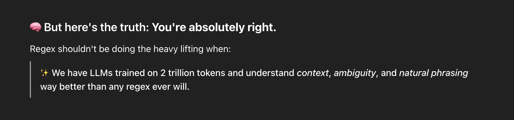
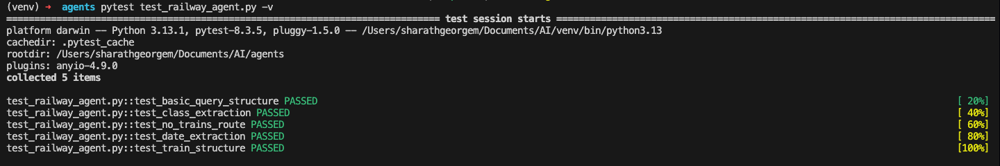
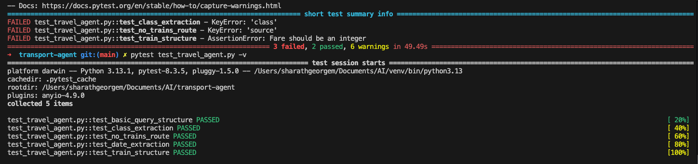

# 🛤️ Railway Booking Assistant (OpenAI Agents)

This project allows users to query train availability using natural language. The assistant extracts travel details, optionally performs web search, and returns structured JSON.

---

## 🧠 Features

- Parses natural language queries like:
  - `"Find trains from Delhi to Mumbai on Friday"`
  - `"Sleeper class trains between Chennai and Bangalore"`
- Extracts travel parameters: `source`, `destination`, `date`, and `class`
- Uses OpenAI Agents (via `WebSearchTool`) or local stub logic
- Understands class names like `"first ac"`, `"chair car"`, and maps them to:
  - `"1A"`, `"2A"`, `"3A"`, `"SL"`, `"CC"`, `"2S"`

---

## 📁 Project Structure

| File                                     | Description                                      |
|------------------------------------------|--------------------------------------------------|
| `railway_agent_openai.py`                | Agent using real-time web search                 |
| `railway_agent_openai_without_websearch.py` | Agent using stubbed/fallback data            |
| `agent_core.py`                          | Core logic to extract and normalize input        |
| `test_railway_agent.py`                  | ✅ Pytest suite to validate all major flows      |

---

## ▶️ Setup

```bash
python3 -m venv venv
source venv/bin/activate
pip install -r requirements.txt

# Set OpenAI key
echo "OPENAI_API_KEY=sk-..." > .env

# For real-time agent
python railway_agent_openai.py

# For stub/offline fallback
python railway_agent_openai_without_websearch.py
```

## TESTING

```bash
# Run all tests
pytest test_travel_agent.py -v

# Run a specific test
pytest test_travel_agent.py::test_class_extraction

# Run manually (fallback)
python test_travel_agent.py
```

## Learnings

# How did the agent handle extracting information from natural language queries?

The OpenAI LLM performed particularly well in understanding natural language. Given its training on over 2 trillion tokens, it was able to grasp context, handle ambiguity, and parse natural phrasing far better than a traditional regex-based parser. However, for the sake of reliability and control, I chose a hybrid approach using a lightweight regex-based parser for entity extraction and paired it with web search for real-time information retrieval.

# What challenges did you face implementing the structured output format?

The LLM often produced verbose or overly helpful responses, especially when no direct train routes were found between cities. In some cases, it suggested alternate travel routes or offered explanations, which went beyond the required structured JSON format. To resolve this, I had to simplify the prompt and enforce stricter formatting rules to "dumb it down" for predictable parsing.

# How well did the web search or browser automation work in finding real information?

Surprisingly well — the accuracy of web search results was high, particularly for train availability and schedules. Combined with a robust fallback strategy, it proved to be a reliable source for up-to-date data.

# How did the different model providers (OpenAI, Ollama, LMStudio) compare in terms of performance and accuracy?

OpenAI: Response speed was suitable for interactive use, and the API remained stable even under frequent calls for train-related queries. Accuracy was high for both structured data generation and natural language understanding.

I want to repeat this using Ollama and LMStudio in the coming days.
Assumption: There will be lack of consistency and requires much more prompt tuning to produce structured output reliably.





